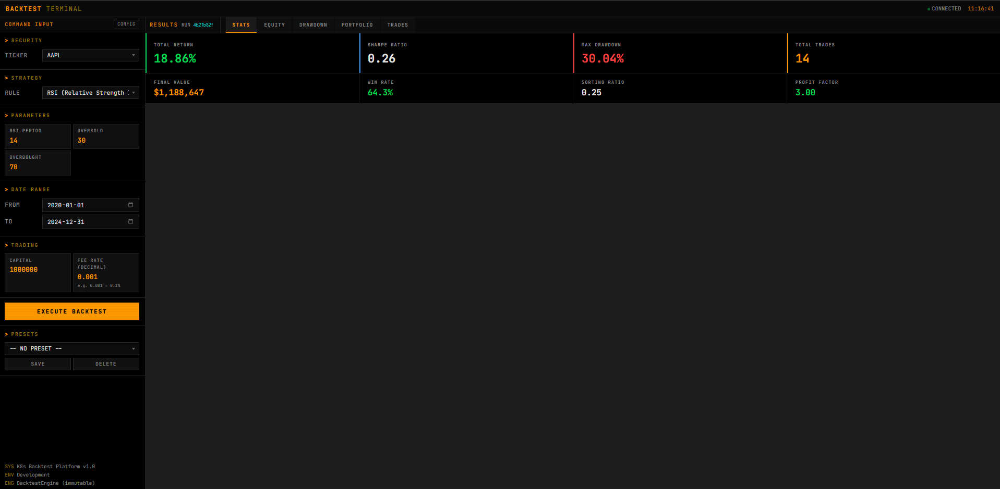
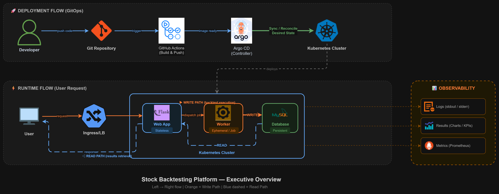
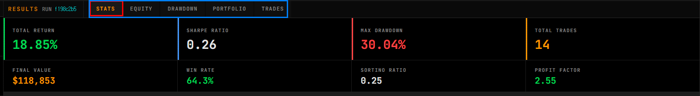

# Kubernetes 기반 주식 백테스트 플랫폼 (Stock Backtesting Platform)

`Python 3.11` | `Flask (Sync)` | `Jinja2 + Bootstrap 5` | `SQLAlchemy` | `Docker (Phase 1)` | `Kubernetes (Phase 2+)` | `MySQL (Phase 2+)` | `GitHub Actions (Phase 4)` | `Argo CD (Phase 4)`

> **검증된 레거시 엔진을 Kubernetes Job으로 확장해 대규모 병렬 처리를 구현하는 클라우드 네이티브 솔루션**



---

## 📌 한 줄 요약

검증된(수정 금지) Python 백테스트 엔진을 컨테이너로 감싸고, 각 백테스트를 **독립적인 Kubernetes Job**으로 실행하도록 설계한 **클라우드 네이티브 백테스트 플랫폼**입니다.

---

## 📖 프로젝트 개요

본 프로젝트는 **“레거시 시스템의 클라우드 전환(Modernization)”**을 목표로 합니다.  
기존의 검증된 Python 백테스트 엔진(Legacy)을 수정 없이 **Docker 컨테이너로 격리**하고, 실행 단위를 **Kubernetes Job**으로 분리하여 확장 가능한 아키텍처로 재설계했습니다.

- **Scalability:** 백테스트 요청 1개 = 독립된 K8s Job 1개 실행
- **GitOps:** Argo CD를 통해 인프라 상태를 Git과 동기화 (Git = Source of Truth)
- **Observability:** Web → Job → DB 전 구간 `run_id` 기반 트레이싱

> **SSOT (Single Source of Truth):** 설계/규칙/계약/Phase 계획의 기준 문서는 `CLAUDE.md` 입니다.  
> 구현 및 문서 작성 시 `CLAUDE.md`를 최우선 기준으로 따릅니다.

---

## 🧭 현재 진행 상태

- **Phase 0 완료:** Flask 웹 대시보드 + Adapter 레이어 + 5-Tab UI + 테스트(83개)까지 구현 완료
- 현재 런타임은 로컬 기준 **동기 실행**이며, Phase 3에서 **Web → K8s Job 비동기 오케스트레이션**으로 전환합니다.
- Phase 1~6을 통해 Docker/K8s/Job/GitOps/관측성까지 클라우드 플랫폼 형태로 완성합니다.

---

## 🏗️ Architecture Overview (Target: Phase 3 이후)

**Web(Stateless)과 Worker(Ephemeral)를 분리**하여 트래픽 폭주 시에도 웹 서버의 안정성을 보장합니다.



### 핵심 설계 포인트

1. **Web-Worker Pattern**  
   Flask Web은 요청 접수/검증/조회만 담당하고, 무거운 연산(백테스트 실행)은 K8s Job(Worker)이 비동기로 처리합니다.

2. **GitOps Pipeline**  
   GitHub Actions(CI)는 이미지를 빌드/푸시하고, Argo CD(CD)는 `k8s/` 매니페스트 변경을 감지하여 자동 배포합니다.

3. **Data Persistence**  
   결과/상태는 StatefulSet으로 배포된 MySQL에 저장되어 영속성을 보장합니다. Web과 Worker는 **DB를 통해서만** 결과를 교환합니다.

👉 더 자세한 네트워크 토폴로지/배포 전략은 **[docs/architecture.md](docs/architecture.md)** 에서 확인할 수 있습니다.

---

## ☁️ 인프라 구성 (Cloud-Native)

> 이 프로젝트의 핵심은 “백테스트 실행을 Kubernetes Job으로 분리”하여  
> **수평 확장 + 운영 가능성 + 재현성**을 동시에 확보하는 것입니다.

### 로컬 패리티 (Phase 1)
- Docker multi-stage 이미지로 Web 앱 패키징 (`python:3.11-slim`)
- `docker compose up` 한 번으로 **web + mysql** 개발 환경 구성
- 설정/시크릿은 `.env` 기반 (레포에는 `.env.example`만 커밋)

### Kubernetes 런타임 (Phase 2–3)
- Namespace: `stock-backtest`
- Web: `Deployment + Service + Ingress`
- DB: `MySQL StatefulSet + PVC`
- Worker: 백테스트 1회 실행 = `Job` 1개 (ephemeral)
- Config/Secret: `ConfigMap` + `Secret` 환경변수 주입
- **RBAC:** Web ServiceAccount는 namespace-scoped Role/RoleBinding으로  
  `jobs.batch`에 대해서만 `create/get/list/delete` 권한 부여 (**ClusterRole 금지**)

### GitOps 배포 (Phase 4)
- CI: GitHub Actions → `pytest` → `docker build` → GHCR push (`:<git-sha-short>`)
- CD: Argo CD가 `k8s/` 디렉터리를 감시하여 auto-sync
- `k8s/`는 클러스터 상태의 **단일 진실 공급원**

### 관측성 (Phase 5)
- 모든 실행에 `run_id(UUID4)` 부여
- Web → Worker(Job) → DB 전 구간 로그에 `run_id` 포함 (stdout/stderr 로깅)

---

## 📸 Key Features (UI / 분석 기능)

**VectorBT 스타일의 5-Tab 대시보드**를 통해 전문적인 퀀트 분석 환경을 제공합니다.

### 1) 매매 타점 시각화 (Portfolio Analysis)
Matplotlib(Agg Backend)로 주가 차트 위에 매수(▲)/매도(▼) 시점을 표시하고, 개별 트레이드 손익(PnL)을 산점도로 시각화합니다.  
(서버 렌더링 → Base64 반환, 로컬 파일 저장 없음)


### 2) 핵심 지표 분석 (Key Metrics)
백테스트 완료 즉시 총 수익률, 샤프 지수, MDD 등 핵심 성과 지표(KPI)를 계산해 제공합니다.



📌 **추가 스크린샷(Equity/Drawdown/Cumulative Return/Trades 등 전체 갤러리):**  
→ **[docs/screenshots.md](docs/screenshots.md)**

---

## ✅ 확정된 설계 불변조건 (Invariants)

아래 항목은 Phase 전반(1–6)에서 유지되는 비협상 규칙입니다. (전체 근거는 `CLAUDE.md`)

| 결정 | 내용 |
|---|---|
| Container Registry | GHCR: `ghcr.io/<owner>/stock-backtest` / **불변 태그만 사용** (`:<git-sha-short>` 또는 semver), `latest` 금지 (Rule 10) |
| RBAC | Web ServiceAccount는 **namespace-scoped** Role/RoleBinding 사용. `jobs.batch`에 대해 `create/get/list/delete`만. **ClusterRole 금지** |
| Job Lifecycle | 성공 Job은 결과 persist 확인 후 Web이 **즉시 삭제**. 실패 Job은 `ttlSecondsAfterFinished: 86400`으로 24시간 보관 후 정리 |
| Secrets | `k8s/secret-template.yaml`만 커밋. 실제 시크릿은 CI/CD 변수 또는 Sealed Secrets로 주입. `k8s/secret.yaml` 실값 커밋 **절대 금지** |
| DB 스키마 초기화 | Production에서 `db.create_all()` 자동 실행 금지. 운영자가 1회성 절차로 수행 (`kubectl exec` 또는 init Job) |

---

## 🚀 Quick Start (Local, Phase 0)

> **Rule 3:** 모든 명령은 반드시 **프로젝트 루트**에서 실행합니다.

### Prerequisites
- Python 3.11+
- pip

### 실행
```bash
pip install -r requirements.txt
python app.py
```

대시보드 접속: **http://localhost:5000**

### 테스트
```bash
python -m pytest tests/ -v
```

---

## 🔌 API Endpoints

| Method | Path | 설명 |
|--------|------|------|
| `GET` | `/` | 웹 대시보드 |
| `POST` | `/run_backtest` | 백테스트 실행 (현재는 동기 실행 / Phase 3에서 Job 비동기화) |
| `GET` | `/api/strategies` | 저장된 Strategy Preset 목록 |
| `POST` | `/api/strategies` | Strategy Preset 저장 |
| `DELETE` | `/api/strategies/<id>` | Strategy Preset 삭제 |
| `GET` | `/health` | 헬스체크 |
| `GET` | `/status/<run_id>` | (Phase 3) run 상태 조회 |

---

## 📁 Project Structure

> 아래 구조는 `CLAUDE.md`의 계획(Phase 1–6)을 반영합니다.  
> 일부 파일은 아직 구현 전이며, 주석에 `[Phase N]`로 표기합니다.

```text
stock_backtest/
|
|-- CLAUDE.md                          # 프로젝트 규칙/계약/아키텍처 (SSOT)
|-- README.md                          # 이 문서
|-- RETROSPECTIVE.md                   # 기술 회고/면접 대비 Q&A
|-- requirements.txt                   # Python 의존성 (Poetry/Pipenv 금지)
|-- .gitignore                         # Git 제외 규칙 (strategies.db 등)
|-- test_structure.py                  # 구조 검증 테스트
|-- app.py                             # ✅ Flask 애플리케이션 진입점 (Web/Controller)
|-- worker.py                          # [Phase 3] K8s Job Worker 진입점
|-- extensions.py                      # ✅ SQLAlchemy 인스턴스 (순환 import 방지)
|-- models.py                          # ✅ Strategy ORM 모델
|-- Dockerfile                         # [Phase 1] Multi-stage Docker 빌드
|-- docker-compose.yml                 # [Phase 1] 로컬 개발: web + mysql
|-- .env.example                       # [Phase 1] 환경변수 템플릿
|-- .dockerignore                      # [Phase 1] __pycache__/, .env 등 제외 (data/는 포함)
|
|-- .github/                           # [Phase 4] CI
|   +-- workflows/
|       +-- ci.yml                     # pytest → build → push (immutable tag)
|
|-- backtest/                          # 핵심 엔진 (READ-ONLY)
|   |-- __init__.py
|   |-- engine.py                      # BacktestEngine -- 수정 금지 (Rule 1)
|   +-- metrics.py                     # PerformanceMetrics
|
|-- rules/                             # 트레이딩 룰 라이브러리
|   |-- __init__.py
|   |-- base_rule.py                   # BaseRule, Signal, RuleMetadata, CompositeRule
|   |-- technical_rules.py             # ✅ RSI, MACD, RSI+MACD 등
|   |-- paper_rules.py                 # Momentum, Value 등
|   |-- rule_validator.py              # RuleValidator, SignalAnalyzer
|   +-- optimizer.py                   # ParameterOptimizer (Grid Search)
|
|-- extracted/
|   +-- features/
|       |-- __init__.py
|       +-- technical_indicators.py    # SMA, EMA, RSI, MACD, BB, ATR 등
|
|-- scripts/
|   |-- config.py                      # 환경변수 기반 설정(Config)
|   |-- data_loader.py                 # 데이터 로더 (yfinance 다운로드 + 검증)
|   |-- logger_config.py               # stdout/stderr 로깅 설정 (Rule 8)
|   |-- qa_prices.py                   # 데이터 품질 검증
|   |-- verify_mvp.py                  # E2E 파이프라인 검증
|   +-- demo.sh                        # [Phase 5] 고정 시나리오 E2E 데모 스크립트
|
|-- adapters/                          # ✅ Adapter Layer (Rule 1 준수)
|   |-- __init__.py
|   +-- adapter.py                     # derived curves/metrics + render_*_chart
|
|-- tests/                             # ✅ Test Suite
|   |-- __init__.py
|   +-- test_day39.py                  # 83 tests
|
|-- templates/
|   +-- index.html                     # ✅ Bootstrap 5 Dark Mode 대시보드
|
|-- k8s/                               # [Phase 2-3] Kubernetes 매니페스트 (GitOps Source of Truth)
|   |-- namespace.yaml
|   |-- configmap.yaml
|   |-- secret-template.yaml           # Template only; real secrets via CI/CD or Sealed Secrets
|   |-- web-deployment.yaml
|   |-- worker-job-template.yaml
|   |-- mysql-statefulset.yaml
|   |-- rbac.yaml                      # SA + Role + RoleBinding (namespace-scoped, jobs.batch only)
|   +-- ingress.yaml
|
|-- docs/                              # [Phase 6] 프로젝트 문서
|   |-- architecture.md                # 아키텍처 다이어그램 (Mermaid)
|   |-- ops-guide.md                   # 운영 가이드 (배포/롤백/트러블슈팅)
|   |-- screenshots.md                 # ✅ UI 스크린샷 갤러리 (이 파일)
|   +-- images/                        # README/Docs용 이미지
|
|-- data/                              # OHLCV CSV 데이터 (재현성 목적)
|   +-- AAPL.csv
```

---

## 🧩 Roadmap (Phase 기반)

| Phase | 상태 | 범위 |
|---|---|---|
| **Phase 0** | ✅ 완료 | 엔진 검증 + Flask 앱 + Adapter + 5탭 UI + 테스트 |
| **Phase 1** | 📋 예정 | Dockerization & Local Parity (Dockerfile, Compose, `.env.example`, healthcheck) |
| **Phase 2** | 📋 예정 | Kubernetes Runtime + Data Layer (Web Deployment, MySQL StatefulSet, ConfigMap/Secret, Ingress) |
| **Phase 3** | 📋 예정 | Web → K8s Job Orchestration (`worker.py`, JobLauncher, `/status/<run_id>`, 결과/상태 MySQL persist) |
| **Phase 4** | 📋 예정 | Automation & GitOps (GitHub Actions CI, Argo CD CD, tag promotion) |
| **Phase 5** | 📋 예정 | Observability 검증(Rule 8) + `scripts/demo.sh` 데모 |
| **Phase 6** | 📋 예정 | 문서화/회고 (architecture, ops guide, retrospective polish) |

---

## 🤝 Contributing / Git Workflow (요약)

- `dev`는 최신 상태 유지
- 신규 작업은 `feature/*` 브랜치에서 진행
- 기능 단위로 PR 생성 → 리뷰/검증 후 merge
- GitOps 대상 매니페스트는 `k8s/` 디렉터리 기준으로 관리  
  (CI가 이미지 태그를 갱신하여 커밋/PR로 반영, CD는 Argo CD가 sync)

---

## 📚 참고 문서

- **`CLAUDE.md`**: 규칙/계약/아키텍처/Phase 계획 (필독)
- **`RETROSPECTIVE.md`**: 설계 결정, 트레이드오프, 면접 대비 Q&A
- **`docs/architecture.md`**: 아키텍처 상세(Mermaid)
- **`docs/ops-guide.md`**: 운영 가이드(배포/롤백/트러블슈팅)
- **`docs/screenshots.md`**: UI 스크린샷 전체 갤러리
