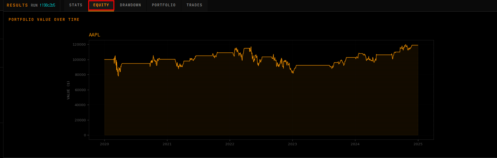
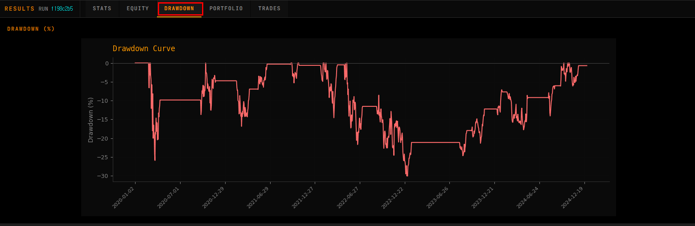
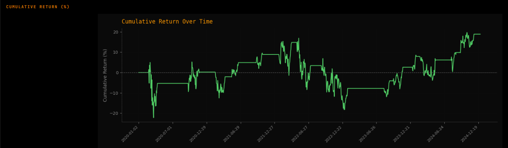
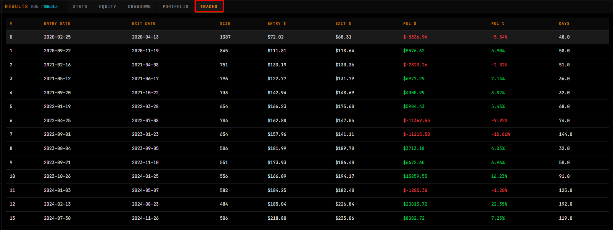

# 📷 UI Screenshots Gallery (Phase 0: Day 3.9)

이 문서는 README에 모두 담기엔 긴 스크린샷들을 **갤러리 형태(접기/캡션 포함)** 로 정리한 페이지입니다.  
현재 스크린샷은 **Phase 0(로컬 동기 실행)** 기준이며, Phase 3 이후에는 Web→K8s Job 비동기 실행 구조로 전환됩니다.

> ✅ 이미지 파일은 아래 경로로 저장하세요:
>
> - `docs/images/01_dashboard_hero.png`
> - `docs/images/02_ui_stats_kpi.png`
> - `docs/images/03_ui_equity_curve.png`
> - `docs/images/04_ui_drawdown_curve.png`
> - `docs/images/05_ui_portfolio_analysis.png`
> - `docs/images/06_ui_cumulative_return.png`
> - `docs/images/07_ui_trades_table.png`

---

## ✅ Figure List

- **Figure 1.** 애플리케이션 UI — 설정 패널 및 전체 대시보드 레이아웃
- **Figure 2.** 백테스트 결과 — Stats 탭 (핵심 KPI 카드)
- **Figure 3.** 백테스트 결과 — Equity Curve (포트폴리오 가치 시계열)
- **Figure 4.** 백테스트 결과 — Drawdown Curve (드로우다운 퍼센티지)
- **Figure 5.** 백테스트 결과 — Portfolio 탭 (Orders 및 Trade PnL 차트)
- **Figure 6.** 백테스트 결과 — Cumulative Return (누적 수익률 차트)
- **Figure 7.** 백테스트 결과 — Trades 탭 (라운드트립 거래 이력)

---

## 🖼️ Gallery

<strong>Figure 1. 애플리케이션 UI — 설정 패널 및 전체 대시보드 레이아웃</strong>

 

- 좌측 **Command Input** 패널에서 티커/룰/기간/거래 파라미터를 설정
- 상단 탭(Stats/Equity/Drawdown/Portfolio/Trades)로 결과를 탐색
- 서버에서 렌더링된 차트를 Base64로 인라인 표출 (로컬 파일 저장 없음)

<strong>Figure 2. 백테스트 결과 — Stats 탭 (핵심 KPI 카드)</strong>

 

- Total Return / Sharpe Ratio / Max Drawdown / Total Trades 등 핵심 KPI 제공
- (Phase 2+ 확장 계획) CAGR, Volatility, Win Rate, Profit Factor 등 추가 가능

<strong>Figure 3. 백테스트 결과 — Equity Curve (포트폴리오 가치 시계열)</strong>

 

- 포트폴리오 가치의 시간 흐름을 시계열로 시각화
- Equity curve는 결과 데이터의 핵심 canonical time-series로 취급

<strong>Figure 4. 백테스트 결과 — Drawdown Curve (드로우다운 퍼센티지)</strong>

 

- 드로우다운(peak-to-trough)을 퍼센티지로 표시
- 엔진 변경 없이 Adapter 레이어에서 `equity_curve`로부터 파생(derived)

<strong>Figure 5. 백테스트 결과 — Portfolio 탭 (Orders 및 Trade PnL 차트)</strong>

 

- **Orders 차트:** 주가 라인 위에 BUY/SELL 마커(▲/▼) 표시
- **Trade PnL 차트:** 개별 트레이드 손익을 산점도로 표시 (profit/loss 분리)
- Matplotlib **Agg backend**로 서버 렌더링 후 Base64로 반환 (Stateless)

<strong>Figure 6. 백테스트 결과 — Cumulative Return (누적 수익률 차트)</strong>

 

- 누적 수익률(%)을 시간축 기준으로 시각화
- `equity_curve`로부터 재현 가능하게 계산/렌더링

<strong>Figure 7. 백테스트 결과 — Trades 탭 (라운드트립 거래 이력)</strong>

 

- 엔진 출력(trades)을 Adapter에서 정규화하여 테이블로 표출
- entry/exit, size, pnl_abs/pnl_pct, holding_period 등 계약 기반 데이터 구조

---

## 🔗 Related Docs

- 아키텍처 상세(Mermaid/설명): **[architecture.md](architecture.md)**
- 운영 가이드(배포/롤백/트러블슈팅): **[ops-guide.md](ops-guide.md)**
